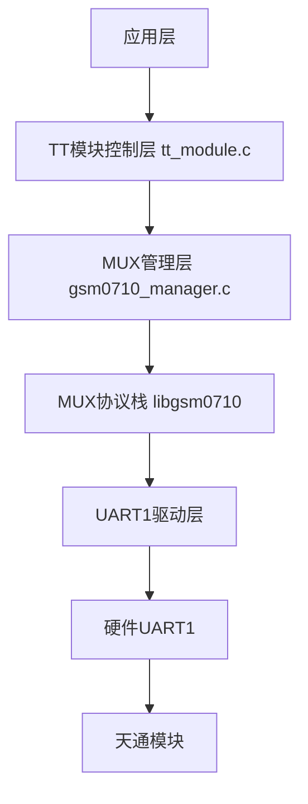
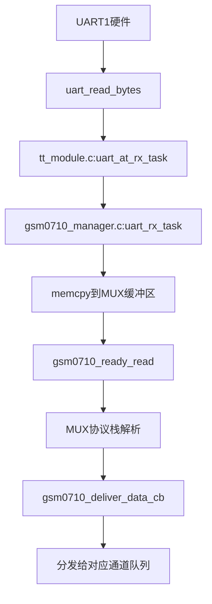
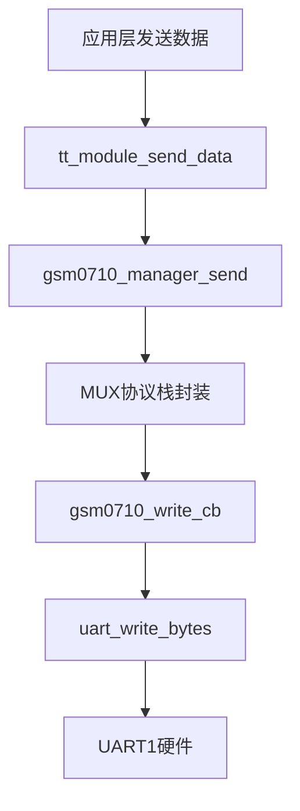

# MUX与UART1读写打通机制分析

## 1. 整体架构概述

TTSatModule项目采用分层设计实现MUX与UART1的读写打通，主要包含以下关键组件：



## 2. UART1初始化流程

UART1的初始化由`tt_module.c`中的`uart_at_init`函数完成：

```c
static esp_err_t uart_at_init(void)
{
    // 安装UART驱动
    ret = uart_driver_install(TT_UART_AT_PORT_NUM, 2048, 2048, 0, NULL, 0);
    
    // 配置UART参数（波特率115200、8N1、硬件流控）
    ret = uart_param_config(TT_UART_AT_PORT_NUM, &uart_at_config);
    
    // 设置UART引脚映射
    ret = uart_set_pin(TT_UART_AT_PORT_NUM, TT_UART_AT_TX_PIN, TT_UART_AT_RX_PIN,
                       TT_UART_AT_RTS_PIN, TT_UART_AT_CTS_PIN);
    
    // 创建SIMST检测信号量
    g_simst_sem = xSemaphoreCreateBinary();
}
```

## 3. MUX模式建立流程

### 3.1 SIMST:1检测

`uart_at_rx_task`任务负责从UART1接收数据并检测SIMST:1通知：

```c
static void uart_at_rx_task(void *pvParameters)
{
    // 读取UART1数据
    int len = uart_read_bytes(TT_UART_AT_PORT_NUM, rx_buf, RX_BUF_SIZE, pdMS_TO_TICKS(100));
    
    // 搜索SIMST:1模式串
    if (memcmp(simst_detect_buf + i, simst_pattern, simst_pattern_len) == 0) {
        // SIMST:1检测到
        g_simst_detected = true;
        xSemaphoreGive(g_simst_sem);
    }
}
```

### 3.2 MUX初始化

`tt_mux_init_task`任务在检测到SIMST:1后，发送AT+CMUX命令进入MUX模式：

```c
static void tt_mux_init_task(void *pvParameters)
{
    // 等待SIMST:1
    xSemaphoreTake(g_simst_sem, pdMS_TO_TICKS(30000));
    
    // 发送AT+CMUX命令进入MUX模式
    char cmux_cmd[] = "AT+CMUX=0,0,5,1600\r\n";
    uart_write_bytes(TT_UART_AT_PORT_NUM, cmux_cmd, cmux_cmd_len);
    
    // 初始化GSM0710 MUX管理器
    gsm0710_manager_init();
    
    // 启动MUX会话
    gsm0710_manager_start();
    
    // 打开各个MUX通道
    gsm0710_manager_open_channel(GSM0710_CHANNEL_AT);
    gsm0710_manager_open_channel(GSM0710_CHANNEL_VOICE_DATA);
    // ... 其他通道
}
```

## 4. MUX与UART1的数据读写打通

### 4.1 数据接收流程



关键代码（`gsm0710_manager.c`）：

```c
static void uart_rx_task(void *pvParameters)
{
    // 从UART1读取数据
    int len = uart_read_bytes(UART_TT_PORT_NUM, rx_buf, RX_BUF_SIZE, pdMS_TO_TICKS(100));
    
    // 将数据传递给MUX协议栈
    if (g_gsm_mgr.gsm_ctx != NULL && g_gsm_mgr.gsm_ctx->buffer_used + len < GSM0710_BUFFER_SIZE) {
        memcpy(g_gsm_mgr.gsm_ctx->buffer + g_gsm_mgr.gsm_ctx->buffer_used, rx_buf, len);
        g_gsm_mgr.gsm_ctx->buffer_used += len;
        gsm0710_ready_read(g_gsm_mgr.gsm_ctx); // 通知MUX协议栈有数据可读
    }
}
```

### 4.2 数据发送流程



关键代码（`gsm0710_manager.c`）：

```c
static int gsm0710_write_cb(struct gsm0710_context *ctx, const void *data, int len)
{
    // 将MUX封装后的数据写入UART1
    int bytes_written = uart_write_bytes(UART_TT_PORT_NUM, (const char *)data, len);
    return bytes_written;
}
```

## 5. 多通道数据处理

MUX协议支持多个逻辑通道，每个通道负责不同类型的数据传输：

| 通道号 | 功能描述 |
|--------|---------|
| 0 | MUX控制通道 |
| 1 | 通用AT指令 |
| 2 | 话音AT指令 |
| 3 | 短信AT指令 |
| 4 | 数据AT指令 |
| 9 | 语音数据 |
| 10 | 物联网数据 |

应用层可以通过`tt_module_send_data`函数指定通道发送数据：

```c
esp_err_t tt_module_send_data(int channel, const uint8_t *data, size_t len)
{
    // 验证参数
    // 通过MUX管理器发送数据
    return gsm0710_manager_send(channel, data, len);
}
```

## 6. 模块复位检测与恢复

为了提高系统稳定性，代码实现了模块复位检测与自动恢复机制：

```c
static void uart_at_rx_task(void *pvParameters)
{
    // ...
    else if (g_tt_module.state == TT_STATE_MUX_MODE) {
        // 在MUX模式下收到意外数据，可能是模块复位
        ESP_LOGW(TAG, "Received data in MUX mode, possible module reset detected!");
        
        // 重置状态到AT命令模式
        g_simst_detected = false;
        g_tt_module.state = TT_STATE_AT_COMMAND;
        
        // 关闭并重新初始化MUX
        gsm0710_manager_stop();
        gsm0710_manager_deinit();
        
        // 重新启动MUX初始化任务
        xTaskCreate(tt_mux_init_task, "tt_mux_init_task", 4096, NULL, 8, &g_mux_init_task_handle);
    }
    // ...
}
```

## 7. 总结

MUX与UART1的读写打通主要通过以下机制实现：

1. **UART1硬件抽象层**：负责原始数据的收发
2. **MUX协议栈**：负责将原始数据封装/解封装为MUX帧
3. **通道管理**：将不同类型的数据分发到对应的逻辑通道
4. **状态机管理**：确保模块在正确的状态下进行通信
5. **错误检测与恢复**：提高系统稳定性

这种分层设计使得应用层可以方便地使用不同的逻辑通道进行数据传输，而无需关心底层的MUX协议细节和UART1硬件操作。